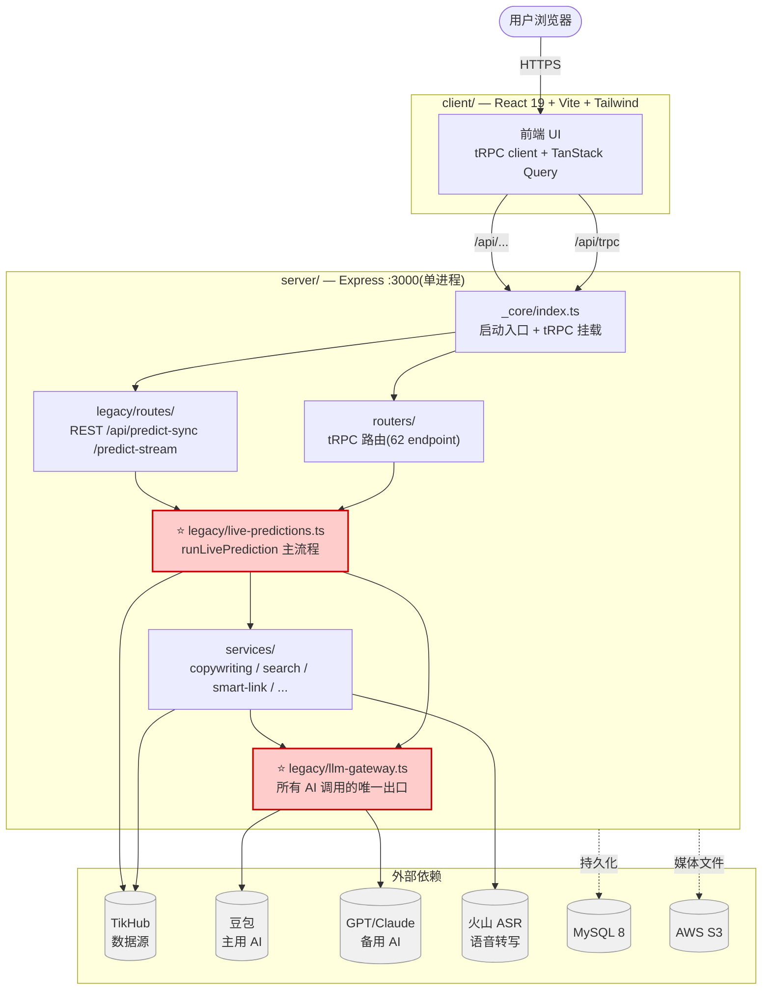
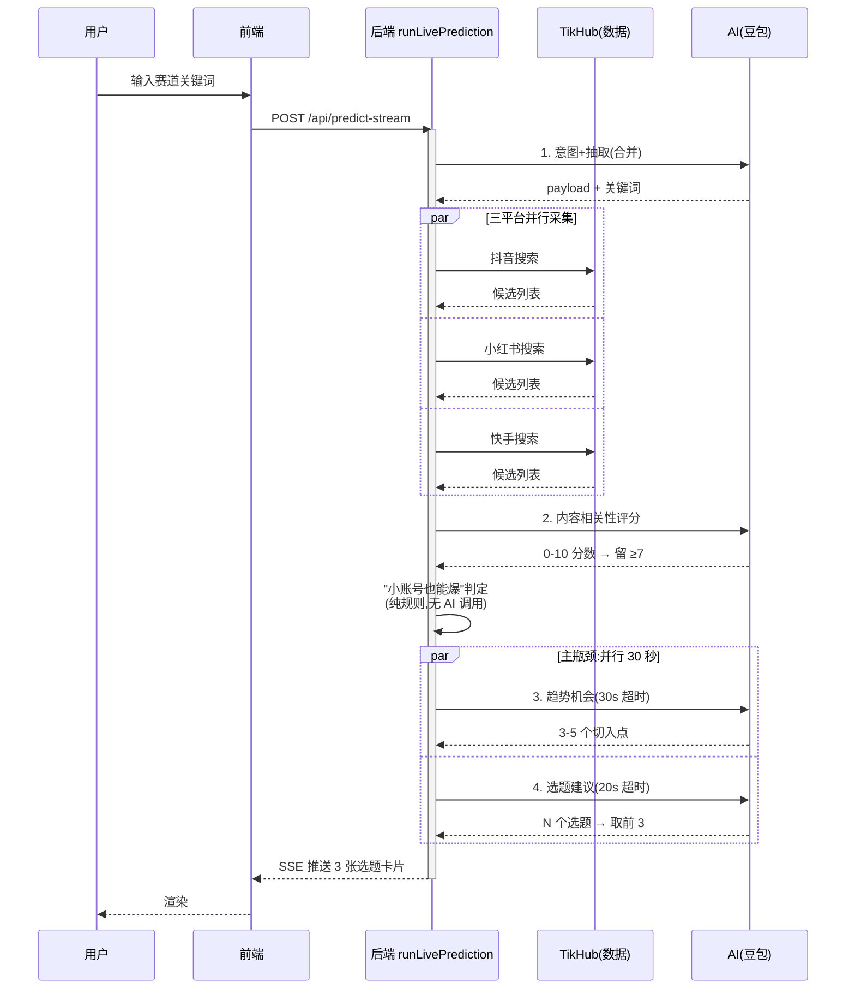

# 架构 (Architecture)

> 项目当前的**静态结构**——模块边界、调用方向、依赖关系。
> 流程动态(一次预测的时序图、超时和降级)看 [docs/系统流程图.md](docs/系统流程图.md);
> 这一份补的是"代码长什么样"。

---

## 一图了然(Mermaid,GitHub 自动渲染)



⭐ = **核心模块,改动概率最高**;红色块表示要改谨慎,改之前先看
[CLAUDE.md](CLAUDE.md) 和 [docs/llm-budget.md](docs/llm-budget.md)。

---

## 一次预测的时序(Mermaid)



> **整条端到端 ≤ 30 秒**(产品 SLO),瓶颈在最后 AI 并行段。详细超时见
> [docs/llm-budget.md](docs/llm-budget.md)。

---

## ASCII 备份图(老环境查看)

```
                        ┌─────────────────────────────┐
                        │        Browser (User)        │
                        └──────────────┬──────────────┘
                                       │ HTTPS
                       ┌───────────────┴───────────────┐
                       │      client/  (React 19)      │
                       │      Vite + Tailwind v4       │
                       │      tRPC client + TanStack   │
                       └───────────────┬───────────────┘
                                       │ /trpc/*  和  /api/*  (同进程)
                       ╔═══════════════╪═══════════════════════════════╗
                       ║         server/  (Express :3000)              ║
                       ║                                                ║
                       ║   _core/index.ts  ←─── 启动入口、tRPC 挂载    ║
                       ║          │                                     ║
                       ║   ┌──────┴──────┐                              ║
                       ║   │             │                              ║
                       ║  routers/     legacy/routes/                   ║
                       ║   tRPC         REST  /prepare-prediction       ║
                       ║   (62 ep)            /predict-sync             ║
                       ║                      /predict-stream (SSE)     ║
                       ║   │             │                              ║
                       ║   └──┬──────────┘                              ║
                       ║      ▼                                          ║
                       ║   legacy/  ⭐ 主预测流程(runLivePrediction)   ║
                       ║      │                                          ║
                       ║      ├─→ services/  服务层(copywriting / search ║
                       ║      │              / smart-link / tikhub-resolver) ║
                       ║      │                                          ║
                       ║      └─→ legacy/llm-gateway.ts  ⭐ 唯一 LLM 出口 ║
                       ╚══════════╪═════════════════════════════════════╝
                                  │
              ┌───────────────────┼───────────────────┐
              ▼                   ▼                   ▼
        ┌─────────┐         ┌─────────┐        ┌──────────┐
        │ TikHub  │         │ Doubao  │        │ Volcengine│
        │ (data)  │         │  (LLM)  │        │   (ASR)   │
        └─────────┘         └─────────┘        └──────────┘

           ┌────────────────────────────┐    ┌──────────┐
           │  MySQL 8 + drizzle-orm    │    │  AWS S3  │
           └────────────────────────────┘    └──────────┘
```

---

## 顶层目录

| 目录 | 角色 | 改动频率 | 备注 |
|------|------|---------|------|
| `client/` | React 前端 | 中 | Vite + Tailwind v4 + Radix UI |
| `server/_core/` | Express 启动 + tRPC 聚合 | 低 | 入口 `index.ts`,改这里要谨慎 |
| `server/legacy/` | ⭐ **核心代码,不是 deprecated** | **高** | 主流程 + LLM 网关都在这 |
| `server/services/` | 较新的服务层 | 中 | 与 legacy/ 并存 |
| `server/routers/` | tRPC 路由 | 中 | 7 个领域 router + auth/system,共 62 个 endpoint,见 [docs/api.md](docs/api.md) |
| `drizzle/` | DB schema + 迁移 | 低 | `pnpm db:push` |
| `data/` | 运行时数据(account 配置 / 缓存) | — | **untracked,不进 git**,见 [data/README.md](data/README.md) |
| `docs/` | 文档 | 中 | |
| `evals/` | LLM 输出评测集 | — | [evals/README.md](evals/README.md) |

---

## 进程模型

**单进程 Express,端口 :3000**(若占用自动找下一个)。

- 同一进程同时挂载:
  - 静态资源(Vite 构建产物)
  - tRPC 路由(`/trpc/*`)
  - Legacy REST 路由(`/api/*`)
- HTTP 层 `requestTimeout = 600s`(为长 LLM 调用拉宽,见 commit `7514446`)。
- 没有独立 worker 进程——预测是 HTTP 请求 inline 完成的。
- node-cron 在同进程跑后台定时(种子刷新等),不抢请求线程。

---

## 模块边界

### `_core/`(基础设施层)

- `index.ts`:Express 启动、中间件注册、tRPC 挂载、static 服务、HTTP 超时
- `trpc.ts`:`publicProcedure` / `protectedProcedure` / `adminProcedure` 定义
- 关键依赖:`createContext`(注入 `ctx.user` / `ctx.db`)

### `routers/`(API 层 — tRPC)

7 个领域 router 文件 + 根 `auth` / `system` 命名空间,共 **62 endpoints**(见 [docs/api.md](docs/api.md))。
- 每个文件聚焦一个领域(copywriting / trending / credits / personalization 等);账号登录、设置页偏好和会话管理在 `server/routers.ts` 的 `auth` namespace
- input 用 zod 内联 schema 定义,output 由 TS 类型推导
- 受保护路由用 `protectedProcedure`,未登录返回 `UNAUTHORIZED`

### `legacy/`(领域层 + 主流程 — **不是 deprecated**)

- **入口**:`live-predictions.ts` `runLivePrediction`——一次完整预测的编排
- **LLM 出口**:`llm-gateway.ts`——所有 LLM 调用必须过这,无例外
- **prompt 和业务逻辑**:见 [docs/prompts.md](docs/prompts.md) 索引
- **REST 路由**:`legacy/routes/prediction-routes.ts`——三个 path,主供前端长流式调用

### `services/`(服务层 — 较新风格)

无状态、可独立测试的小工具/服务:
- `copywriting-extract.ts` — 文案优化 + 金句提取
- `search-keyword-validator.ts` — 关键词主题校验
- `smart-link-parser.ts` — URL 智能解析(平台限制检测)
- `tikhub-video-resolver.ts` — 视频 URL → 平台 + 视频 ID
- `viral-breakdown.ts` — 爆款拆解
- `comment-service.ts` / `comment-collector.ts` — 评论采集与情感分析
- `content-tag-cache.ts` / `city-cache.ts` — 内存 LRU 缓存

`legacy/` 调 `services/`,反过来不行(避免循环依赖)。

---

## 关键调用方向

```
HTTP request
  ↓
_core/index.ts  (Express)
  ↓
routers/  OR  legacy/routes/   (tRPC OR REST)
  ↓
legacy/live-predictions.ts → runLivePrediction()
  ↓
  ├─→ legacy/payload-extractor.ts   (LLM)
  ├─→ legacy/intent-agent.ts         (LLM)
  ├─→ legacy/semantic-filter.ts      (LLM × 1–2)
  ├─→ services/comment-service.ts    (LLM)
  ├─→ services/content-tag-cache.ts  (LLM if miss)
  ├─→ services/city-cache.ts         (LLM if miss)
  ├─→ legacy/low-follower-tagger.ts  (LLM, 条件触发)
  └─→ legacy/llm-gateway.ts          ← 所有 LLM 在此汇聚
            │
            ├─→ Doubao (主)
            ├─→ GPT-5.4 / Claude 4.6 / Apollo (备选,见 ADR-0001)
            └─→ Forge (最终 fallback)
```

每一步详细超时和重试见 [docs/llm-budget.md](docs/llm-budget.md)。

---

## 数据存储

| 存储 | 用途 | schema |
|------|------|--------|
| **MySQL 8** | 业务主库:用户、订单、积分、内容日历、通知、预测历史 | `drizzle/schema.ts` |
| **AWS S3** | 媒体文件:转写音频、视频帧抽取产物 | 路径约定见 services/viral-breakdown.ts |
| **`data/` JSON 文件** | 运行时态数据:已验证账号、API 健康、预测结果缓存 | 见 [data/README.md](data/README.md) |
| **内存 LRU(进程内)** | 高频小 prompt 缓存(tag / city) | content-tag-cache / city-cache |

**没有 Redis / 队列 / 独立 cache 层**——重启即清缓存,这是已知约束。

---

## 外部依赖

| 服务 | 用途 | 失败影响 | 降级 |
|------|------|---------|------|
| **TikHub** | 抖音/小红书/快手数据采集 | 主流程无样本 | 见 [docs/SLA-降级表.md](docs/SLA-降级表.md) |
| **Doubao(火山方舟 ARK)** | 主 LLM | 整体预测失败 | gateway 自动 fallback Forge |
| **Volcengine ASR** | 视频语音转写 | 跳过转写,走文本路径 | inline 跳过 |
| **AWS S3** | 媒体存储 | 媒体类功能受限 | 见 SLA |
| **MySQL** | 主数据库 | 服务直接拒绝 | 无降级,需运维介入 |

---

## 安全边界

- `.env` 里所有 API key,**不进 git**(`.gitignore` 已覆盖)
- `data/` 目录里的 `connector-secrets.json` 含 AES-GCM 加密的会话凭证,
  **`data/` 整个目录 untracked**
- tRPC `protectedProcedure` 依赖 `ctx.user`,中间件失败抛 `UNAUTHORIZED`
- 用户输入(prompt / URL)直接进 LLM,**没有专门的 prompt injection 防护**——
  这是一个**已知风险**(见后续 SECURITY.md)

---

## 已知架构债

1. **`legacy/` 命名误导**——核心代码却叫 legacy,见 [ADR-0002](docs/decisions/0002-legacy-naming-not-renamed.md)
2. **Prompt 散落**——19 条 prompt 在 12 个文件里,见 [docs/prompts.md](docs/prompts.md)
3. **没有 prompt 级缓存**——同 prompt 相同输入仍打 LLM
4. **集成测试缺位**——51 个测试主要是单元 + 部分集成,主流程没有 e2e
5. **没有独立 worker / 队列**——长任务挤占 HTTP 请求

每条都不是当前 P0 要修的,但 onboarding 时新人会看到,先有正式记录。

---

## 相关文档

- [README.md](README.md) — 项目总览
- [CLAUDE.md](CLAUDE.md) — AI 协作者上下文
- [docs/系统流程图.md](docs/系统流程图.md) — 一次预测的动态时序
- [docs/llm-budget.md](docs/llm-budget.md) — LLM 调用预算和超时
- [docs/SLA-降级表.md](docs/SLA-降级表.md) — 外部依赖降级策略
- [docs/api.md](docs/api.md) — tRPC + REST 路由清单
- [docs/decisions/](docs/decisions/) — 架构决策记录
