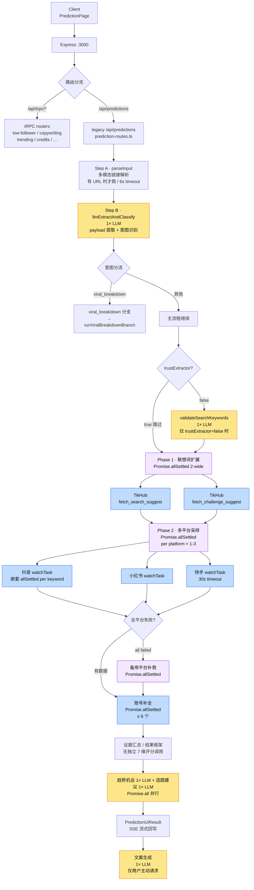

# 一次预测的全链路图

> 主流程入口：[`runLivePrediction`](../server/legacy/live-predictions.ts) · 调用方：[`prediction-routes.ts`](../server/legacy/routes/prediction-routes.ts)
>
> **每画一个节点，请数一次它的 LLM / TikHub / ASR 调用次数**。这张图存在的意义就是把扇出可视化。

## Mermaid



## LLM 调用预算（一次预测）

> 2026-04-29 代码真值：主流程**必发 3 次 LLM**（合并提取 1 + 趋势机会 1 + 选题建议 1），
> `validateSearchKeywords` 等为条件调用；整条预测链路的典型预算仍按 [llm-budget.md](llm-budget.md) 的 **6-8 次** 看。

| # | 调用点 | 文件 | 必发？ |
|---|--------|------|--------|
| 1 | `llmExtractAndClassify`（Step A+B 合并） | payload-extractor.ts | 是 |
| 2 | 趋势机会调用 | live-predictions.ts | 是 |
| 3 | 选题建议调用 | live-predictions.ts | 是 |
| - | `validateSearchKeywords` | search-keyword-validator.ts | 条件调用（`trustExtractor=false` 时） |
| - | 7 维评分（`generateAIScoreBreakdown`） | ai-scoring-engine.ts | **不在主流程**（仅 trend-api.ts 用）|
| 文案 | 文案生成 | copywriting-extract.ts L262 | 仅用户主动请求时 |

**改造后主流程必发**：3 次 LLM/预测。**机会/选题两步是并行执行**，墙钟时间取二者最大值，而不是合并成 1 次调用。

> ⚠️ 「越做越重」的根因仍是 LLM 调用次数。新增 LLM 调用前**先看这张表**，问自己「能不能并到现有 3 次必发里 / 能不能用规则替代」。

## 并发扇出图

```
runLivePrediction
├── parseInput (multimodal, 仅 URL, 6s)
├── llmExtractAndClassify (1× LLM, 12s timeout)
├── Promise.allSettled (联想词) ··· 2-wide
│   ├── TikHub fetch_search_suggest
│   └── TikHub fetch_challenge_suggest
├── Promise.allSettled (per platform) ··· 1-3 wide
│   └── Promise.allSettled (per keyword) ··· ≤ 2 wide  [嵌套]
├── Promise.allSettled (fallback platforms) ··· 仅全部失败时
├── Promise.allSettled (account enrich) ··· slice(0, 6)
└── Promise.all
    ├── 趋势机会 (1× LLM, 30s timeout)
    └── 选题建议 (1× LLM, 20s timeout)
```

**最深嵌套 = 2 层**。扇出基本有界（关键词 ≤ 2、平台 ≤ 3、账号 ≤ 6）。当前最大的延时优化来自**合并提取**和**趋势/选题并行**，不是把后两者合并成 1 次调用。

## 默认超时

| 调用 | 超时 | 来源 |
|------|------|------|
| parseInput（多模态解析） | 6_000 ms | live-predictions.ts L214 |
| Step A+B 合并 LLM | 12_000 ms | live-predictions.ts (mergedExtractTimeoutMs) |
| 趋势机会 LLM | 30_000 ms | live-predictions.ts L1548 |
| 选题建议 LLM | 20_000 ms | live-predictions.ts L1605 |
| LLM 默认 | 60_000 ms | llm-gateway.ts L137 |
| LLM 流式 | 90_000 ms | llm-gateway.ts L242 |
| TikHub 单次 | 20_000 ms（env 可覆盖） | tikhub.ts L8 |
| 快手搜索 | 30_000 ms | tikhub.ts L680 |
| 趋势 / 选题并行段 | 30_000 / 20_000 ms | live-predictions.ts L1548 / L1605 |
| LLM warmup | 15_000 ms | llm-gateway.ts L459 |
| Monitor 单任务 | 120_000 ms | monitor-scheduler.ts |

详细降级行为见 [SLA-降级表.md](SLA-降级表.md)。

## 后台调度（不属于主预测路径）

`monitor-scheduler.ts` 是定时巡检任务（账号监控、日报刷新等），独立于主预测：

- `maxConcurrent = 3`
- 速率：≤ 10 次 TikHub / 分钟
- 重试：最多 2 次，5s 起始指数退避
- 单任务超时 120s

**主预测路径不经过这个调度器**，但它会和主预测**共享 TikHub 配额**。

### 低粉爆款库 billboard 入库管线（管线 B,ADR-0007）

`server/scripts/run-billboard-pipeline.ts`,**完全离线**于主预测：

- **触发**:cron 每天 08:00（见 [deployment.md](deployment.md#cron)）
- **流程**:类目树 refresh → 每类目 POST `fetch_hot_total_low_fan_list`(`date_window=2`) → LLM 预检查（doubao,批 10,thinking 关）→ cleaner 入库 → 回填 `source/industry_*/prefilter_reason`
- **预算**:初始阶段 ~120 次 LLM/天 + ~60 次 TikHub/天,日成本 < $0.15
- **报警**:预检查通过率 < 10% 触发 `log.error`（说明 prompt 漂移或类目变更）
- **管线 A（seed_topic 检索）**:不变,由 `live-predictions.ts` 实时触发,与管线 B 并存,各自打 `source` 标记
